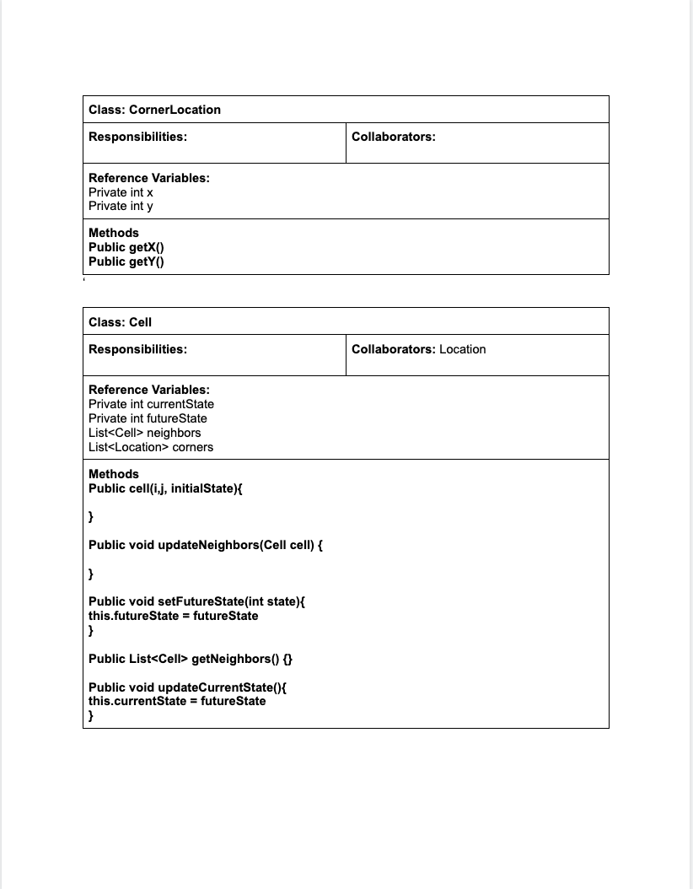
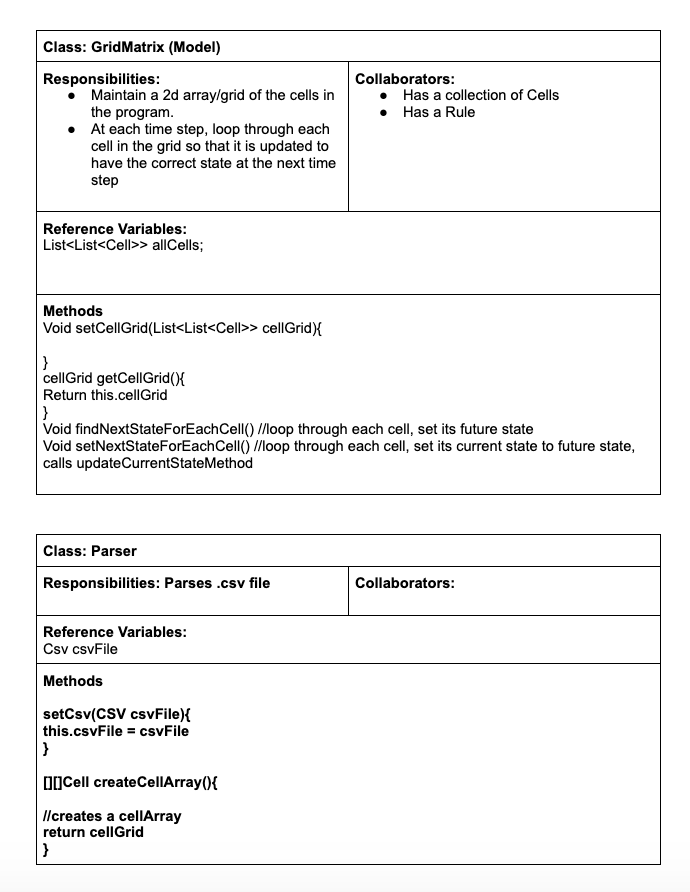
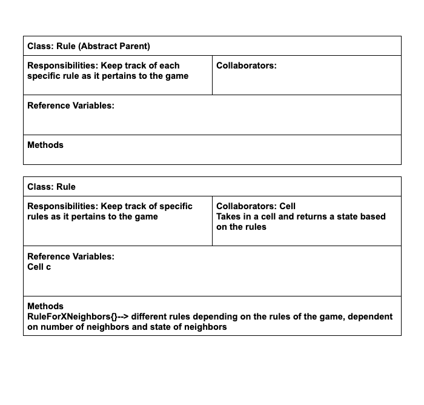
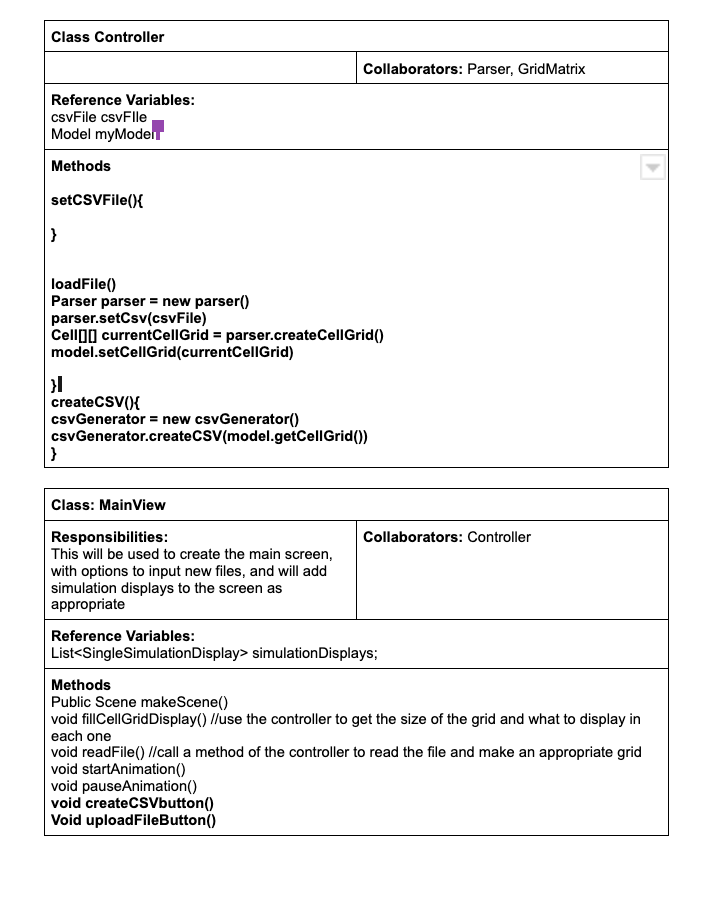
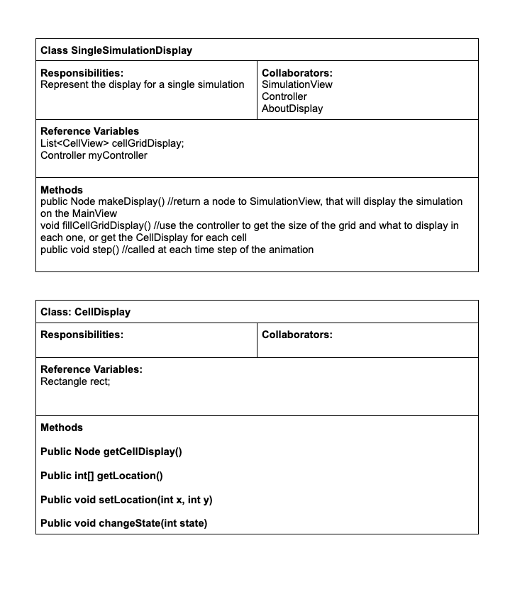
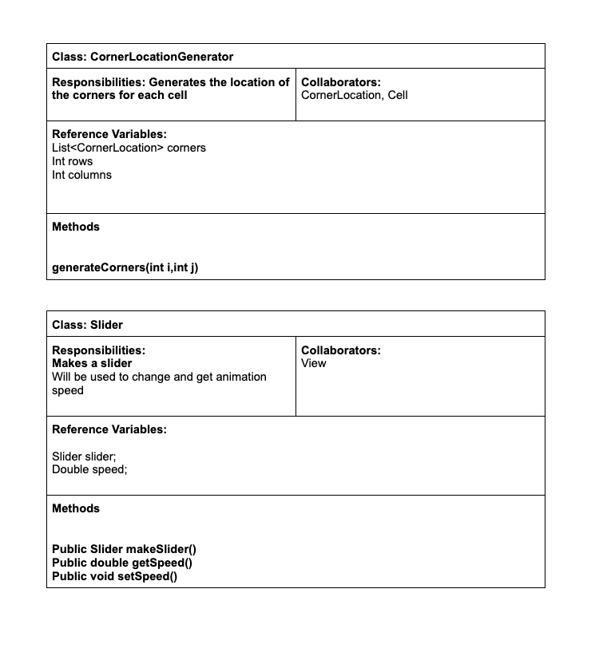
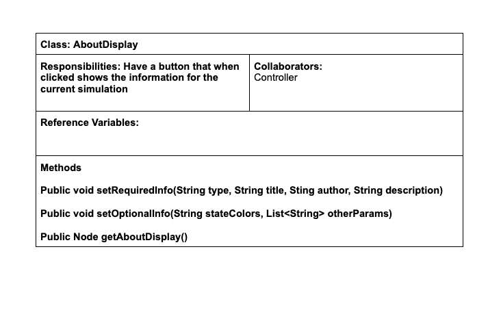
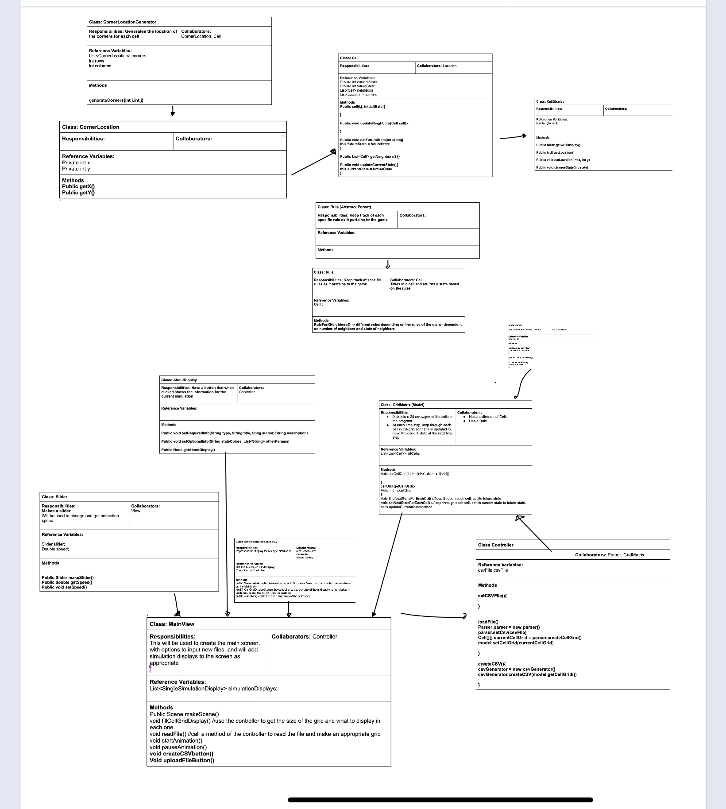
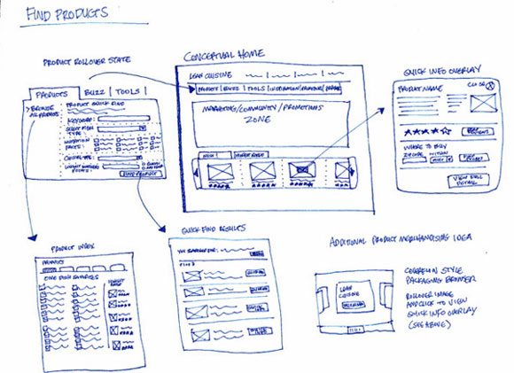

# Cell Society Design Plan
### Team Number
4
### Names
Jeremy Cross

Tarun Amasa

Keith Cressman

Evan Kenyon

## Design Overview

## Design Details

Here is a graphical look at my design:

Here are some example test cases demonstrating how the various classes work together:
1. At a step of the animation, each cell is updated
  * SimulationView.step() //includes the indented code below
    * myController.myModel.findNextStateForEachCell() //includes indented code below
      * for (Cell c : allCells)
        * List<Cell> neighbors = c.getNeighbors()
        * c.setFutureState(Rule.RuleForXNeighbors(neighbors.size()))
    * myController.myModel.setNextStateForEachCell() //includes indented code below
      * for (Cell c : allCells)
        * c.updateCurrentState()
          * c.myCellDisplay.changeState()

2. A user inputs a csv file, creating a new grid
  * MainView.handleSelectedFile(file)
    * SingleSimulationDisplay simDisplay = new SingleSimulationDisplay()
    * simDisplay.myController.loadFile(file) //includes the indented code below
      * Parser p = new Parser()
      * p.setCSV(file)
      * myModel.setCellGrid(p.createCellArray())
    * Node displayForMainView = simDisplay.makeDisplay() //includes the indented code below
      * //use the controller to get each cell display, and add each to a JavaFX component
      * //add some other GUI components, like buttons to stop/pause animation
    * MainView.addSimulationDisplay(displayForMainView)

## Design Considerations

#### Design Issue #1

An important design issue that we ran into was which class should have the responsibility of knowing a
cell's neighbors. Specifically, we debated whether to have that responsibility inside of
our GridMatrix class or inside of our Cell class. The pros for having it in our GridMatrix class
was that it would fit well with having a 2D array of cell locations, since the math for rectangular
cell neighbors is fairly simple. Additionally, the Cell class and GridMatrix classes would be 
simpler, giving us more time to work on other parts of the project. However, the main con was that
this design would be inflexible to different shaped grids. Since more requirements can be added,
we thought that one potential requirement we should be ready for would be different shaped grids
(since triangle grids and hexagonal grids could both be used for apps like this). This was the main 
pro to shifting the responsibility of knowing a Cell's neighbors to the Cell class itself. The con
to this was increasing the amount of code in both the GridMatrix and Cell classes (at least We 
believe that this will happen) and decreasing efficiency, however even though we would have more
code and lower efficiency, that is not as important as the flexibility of the design. Therefore,
we have decided to put the responsibility of knowing a Cell's neighbors in the Cell class.

#### Design Issue #2

Another important design issue that we ran into was whether to have a Rule class for each app that
handles all the rules of an app (i.e. for game of life it would handle all 4 rules), or to have
a RuleBook class which had a list of Rule classes, where each Rule class would be responsible for
one of the app's rules (i.e. there would be a RuleBook class for each app, and an example Rule
class would be one for the case where a location has 0 neighbors in game of life). One pro of the
Rule class that handles every rule of a game is that only one class would be in charge of changing
the Cell class's state, so there would not be as many classes collaborating with it. Another pro of
that design choice is less code complexity, allowing for a more readable program that still
maintains the single responsibility principle. However, a con is that, although the Rule class
still has one responsibility (handling updating a cell's state), it would be a relatively large 
class and could have a switch case statement as well. The RuleBook class, on the other hand,
could have a map of number of neighbors/neighbor states to Rule objects, thus eliminating the 
potential use of a switch case statement. Additionally, this would extract some functionality
from the Rule class, which could be viewed as better upholding the single responsibility principle.
However, a con would be that there would be more classes collaborating with the Cell class, thus
raising the possibility of unexpected errors. So far, we've tentatively decided to go with the
Rule class that handles all the rules for an app for simplicity's sake (and since it still follows
basic design principles), but we are open to the other design idea if code smells start to pop up.

## User Interface

Here is our amazing UI:

taken from [Brilliant Examples of Sketched UI Wireframes and Mock-Ups](https://onextrapixel.com/40-brilliant-examples-of-sketched-ui-wireframes-and-mock-ups/).

## Team Responsibilities

 * Evan Kenyon

Primary: Controller
Secondary: Frontend

 * Tarun Amasa
 
Primary: Backend
Secondary: Controller, Parser

 * Remy Cross

Primary: Backend
Secondary: Frontend

 * Keith Cressman

Primary: Frontend
Secondary: Controller

#### Proposed Schedule
10/19: Finish basic Game of Life
10/26: Have a basic version of each application working
10/29: Refactor and edit, make necessary changes
11/1: Add finishing touches and submit